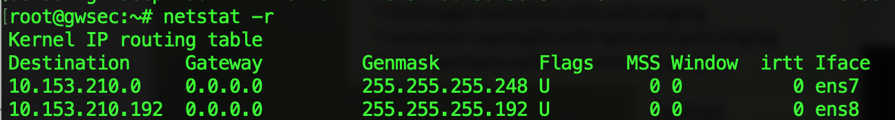
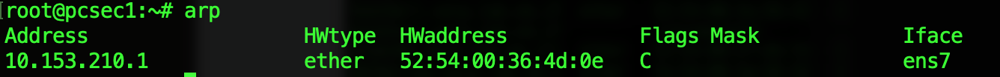
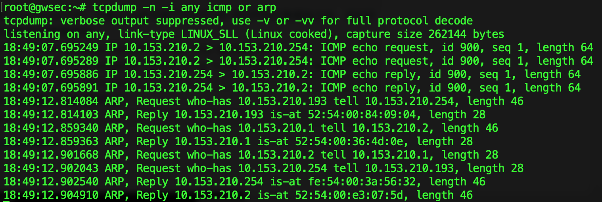
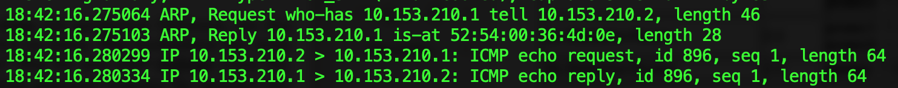
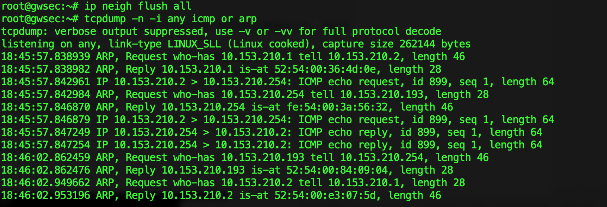
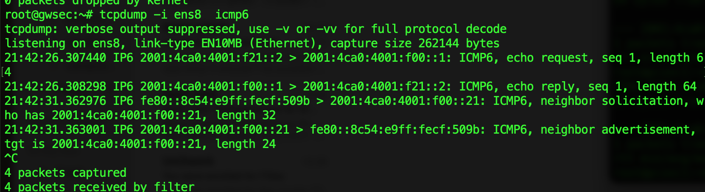
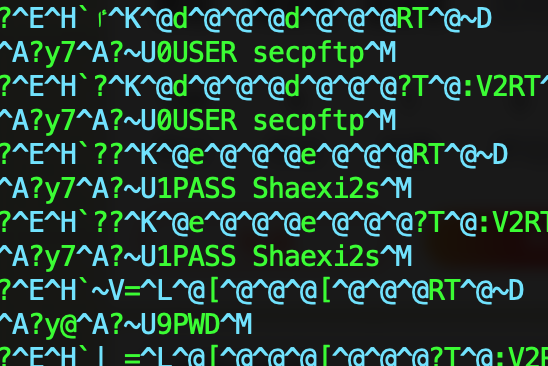

#Blatt 1
--------------------
##Aufgabe_1
###1.a) Answer:
* Broadcast addr: 10.153.210.7
* available Subnet Addresses: 10.153.210.1-10.153.210.6

###1.b) Answer:
* In intern network, the ipv4 area is from 10.153.210.1(gwsec) ~ 10.153.210.254(secserver), so the smallest ipv4/submask should be <mark>10.153.210.0 /24 </mark>  (255.255.255.0)

###1.c) Answer:
* In praktikum network, the ipv6 with common prefix 2001:4ca0:4001:f21:: /64, but some in infrastructure with the ipv6 adr: 2001:4ca0:4001:f00::1, so the Smallest ipv6 prefix should be: <mark>2001:4ca0:4001:f00:: /56</mark> .

-----------------
##Aufgabe_2
###2.a) Answer:

* ARP:	arp cache is empty on gwsec, pcsec1 and pcsec2
* Netstat:
	* **gwsec**:
		> root@gwsec:~# netstat -r
		
			Kernel IP routing table
			Destination     Gateway         Genmask         Flags   MSS Window  irtt Iface
			10.153.210.0    0.0.0.0         255.255.255.248 U         0 0          0 ens7

	* **pcsec2** and **pcsec1**: are both empty
* Ifconfig:
	* **pcsec1** and **pcsec2**:
		
		> root@pcsec1:~# ifconfig 
		
			ens2: ...
			lo: ...
			
	* **gwsec**:

		>root@gwsec:~# ifconfig 
		
			ens2:...
			ens7:...
			ens8:...
			lo:...

* Äquivalenten Parameter:
	* ip neigh = arp 	
	* ip route = netstat -route
	* ip link / ip addr = ifconfig

###2.c) 		
* From **gwsec**:
	* hacktest unreachable
		*  **Ipv4 reason: Destination Host Unreachable**
		*  **Ipv6 reason: Address unreachable**
	* findme unreachable with ipv6 pinging, **reason: address unreachable**	
	* pcsec1, pcsec2 reachable with ipv4 and ipv6 pinging
	* findmegw reachable with ipv6 pinging 	
	* secserver reachable with ipv4 and ipv6 pinging
	* dns reachable with ipv4 and piv6 pinging

* From **pcsec1:**
	* pcsec2 reachable (ipv4 & ipv6)
	* gwsec reachable (ipv4 & ipv6)
	* secserver, hacktest, dns, findme, findmegw -- unreachable, **reason: network unreachable**

* From **pcsec2:**
	* pcsec1 reachable (ipv4 & ipv6)
	* gwsec reachable (ipv4 & ipv6)
	* secserver, hacktest, dns, findme, findmegw -- unreachable, **reason: network unreachable**

###2.d)
* From **gwsec:**
	* ARP: some ARP eneries are cached
	 
	* Routing Table:
	

* From **pcsec1:**
	 * ARP: some ARP eneries are cached
	 

	 *  Routing Table:
	

* From **pcsec2:**
	 * the same as **pcsec1**

---------
##Aufgabe_3
###3.d)
* Added Item: the default route and route in Praktikumnetz in routing table.

------------
##Aufgabe_4

###4.a)
I use command to capture the infomation for icmp and arp
	> root@gwsec:~# tcpdump -n -i ens7 icmp or arp

* **Before** clear the the ARP Table
	* When  **ping 1 time from pcsec1 to gwsec**,  the Messages for **ICMP:**
		* 

		* each time of ping, it has ***one ICMP echo request and one ICMP echo reply***
	
	* When **ping 1 time from pcsec1 to secserver**, the Message for **ARP request:**
		* 

		* each time of ping, it will forward to secserver with interface ens8.
* **After** clear the ARP Table
	* When  **ping 1 time from pcsec1 to gwsec**,  the Messages for **ICMP:**
		* 
		* It will first has ARP message to tell pcsec1 where is gwsec
	* When **ping from pcsec1 to secserver**, the Message for **ARP request:**
		* 
		* The order of Arp and ICMP is different from the time before clearing the arp table.  Arp normally first to tell where the dst to the gwsec and pcsec1.

### 4.b)

ARP table has the entries only from pcsec1(10.153.210.2), without pcsec2, because till now the ping request is only from pcsec1.

###4.c)
* When **ping 1 time from pcsec1 to secserver**, the Message for **ARP request:**
	*	
	*  It has a Neighbor solication message to gateway gwsec and a neighbor advertisement message from gwsec. similar as arp in ipv4.

###4.e)

###4.f)
No influence, because it is only the redundancy for the ipv6 routing table, if u know the gateway is secserver, it is already the default route with metric 1024, and also the addr/netmask route rule with metric 256,
so the last configuration line  in /etc/network/interfaces  `up ip -6 route add 2001:4ca0:4001:f00::/56 dev ens8` that is **not necessary**.
We can just **remove** this routing rule.
###4.g)
* **Address space:** 2^(128-124)   - 2 =14
* When ` ping -6 2001:4CA0:4001:F7F::1:1` , the massage is "Destination unreachable: Address unreachable",
* But when `ping -6 2001:4CA0:4001:F7F::1:5`, do not have any message, it should that request is arrived but no reply. so **2001:4CA0:4001:F7F::1:5** is the PC findme.

-------------
##Aufgabe_5
###5.a)
Open two terminal in pcsec1 and one terminal in pcsec2, to capture the tcp process between pcsec1 and pcsec2 by using **netcat (nc) and tcpdump**.
* pcsec2: `root@pcsec2:~# nc 10.153.210.2 5050`
* pcsec1: 
	* 1 terminal listen  from the port 8888 :  `root@pcsec1:~# nc -l 5050`
	* another terminal use tcpdump to capture: `root@pcsec1:~# tcpdump -i any port 5050`

* When establish tcp , is has **three way handshake**
>17:12:47.888313 IP 10.153.210.3.60458 > 10.153.210.2.5050: Flags [S], seq 723060802, win 29200, options [mss 1460,sackOK,TS val 16027947 ecr 0,nop,wscale 6], length 0
>
>17:12:47.888391 IP 10.153.210.2.5050 > 10.153.210.3.60458: Flags [S.], seq 2959093708, ack 723060803, win 28960, options [mss 1460,sackOK,TS val 16027793 ecr 16027947,nop,wscale 6], length 0
>
>17:12:47.893616 IP 10.153.210.3.60458 > 10.153.210.2.5050: Flags [.], ack 1, win 457, options [nop,nop,TS val 16027948 ecr 16027793], length 0

	*  1: PCSEC2 sends a synchronization flag (SYN) in a TCP segment to create a connection.
	*  2: PCSEC1 receives the SYN flag and returns an acknowledgment flag (ACK).
	*  3: PCSEC2 receives the SYN flag and returns it's own ACK flag.
* Contacting with message "HELLO WORLD"(from pcsec2 to pcsec1)
> 17:14:38.773478 IP 10.153.210.3.60458 > 10.153.210.2.5050: Flags [P.], seq 1:14, ack 1, win 457, options [nop,nop,TS val 16055669 ecr 16027793], length 13
>
>17:14:38.773561 IP 10.153.210.2.5050 > 10.153.210.3.60458: Flags [.], ack 14, win 453, options [nop,nop,TS val 16055514 ecr 16055669], length 0
	*  1: PCSEC2 sends packet incl. amessage to PCSEC1.
	*  2: PCSEC1 receives the packet and returns an acknowledgment flag (ACK).

* Closing TCP Connection
>17:15:07.366536 IP 10.153.210.3.60458 > 10.153.210.2.5050: Flags [F.], seq 14, ack 1, win 457, options [nop,nop,TS val 16062817 ecr 16055514], length 0
>
>17:15:07.367041 IP 10.153.210.2.5050 > 10.153.210.3.60458: Flags [F.], seq 1, ack 15, win 453, options [nop,nop,TS val 16062663 ecr 16062817], length 0
>
>17:15:07.375872 IP 10.153.210.3.60458 > 10.153.210.2.5050: Flags [.], ack 2, win 457, options [nop,nop,TS val 16062819 ecr 16062663], length 0

	*  1: PCSEC2 sends FIN flag to request PCSEC1 to close the connection
	*  2: PCSEC2 receives the request and send the ACK  return to PCSEC2 to cloes the connection.
	*  3: PCSEC2 send the last ACK to PCSEC2 to check the connection is closing.

	(it has some difference from the known 4 ways handshake to terminate the connection, without PCSE1 ack -> PCSEC2  between phase 1 and phase 2).

###5.b)

It has switch between pcsec1, pcsec2 and gwsec in intern net, If pcsec1 pings pcsec2, the ARP message first sends to all clients within the group network, then goes directly to pcsec2 via the switch.
It has a hub in praktikumnet, because we can listen to the FTP communication between findmegw and secserver. Hub can  send the messages they receive and send out to  all other. For example, it also sends the messages to the gwsec via the ens8 interface.

###5.c)
In Gwsec , using command `tcpdump -v -XX -i ens8 port ftp -w data.bin`
to capture the ftp protocol with content, and got it the **user: secpftp , pass: Shaexi2s**,

then wrote the bash script to write date to the file which names gruppeXX.secp.lab.nm.ifi.lmu.de and put it to the ftp server.
 