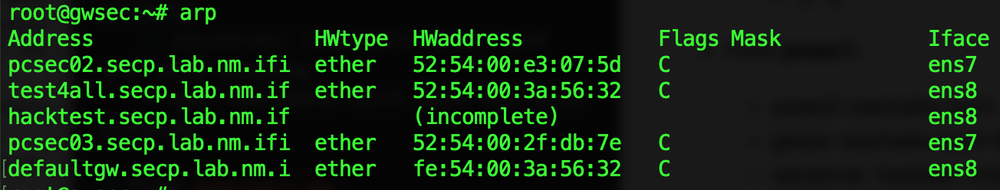
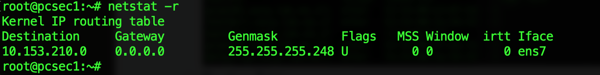
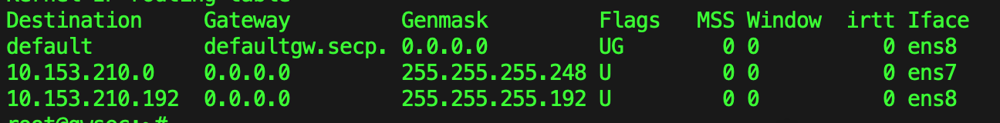
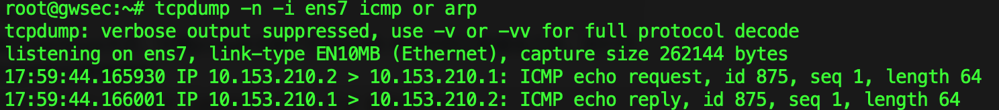
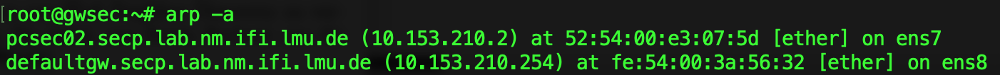

#Blatt 1
--------------------
##Aufgabe_1
###1.a) Answer:
* Broadcast addr: 10.153.210.7
* available Subnet Addresses: 10.153.210.1-10.153.210.6

###1.b) Answer:
* In intern network, the ipv4 area is from 10.153.210.1(gwsec) ~ 10.153.210.254(secserver), so the smallest ipv4/submask should be <mark>10.153.210.0 /24 </mark>  (255.255.255.0)

###1.c) Answer:
* In praktikum network, the ipv6 with common prefix 2001:4ca0:4001:f21:: /64, but some in infrastructure with the ipv6 adr: 2001:4ca0:4001:f00::1, so the Smallest ipv6 prefix should be: <mark>2001:4ca0:4001:f00:: /56</mark> .

-----------------
##Aufgabe_2
###2.a) Answer:

* ARP:	arp cache is empty on gwsec, pcsec1 and pcsec2
* Netstat:
	* **gwsec**:
		> root@gwsec:~# netstat -r
		
			Kernel IP routing table
			Destination     Gateway         Genmask         Flags   MSS Window  irtt Iface
			10.153.210.0    0.0.0.0         255.255.255.248 U         0 0          0 ens7

	* **pcsec2** and **pcsec1**: are both empty
* Ifconfig:
	* **pcsec1** and **pcsec2**:
		
		> root@pcsec1:~# ifconfig 
		
			ens2: ...
			lo: ...
			
	* **gwsec**:

		>root@gwsec:~# ifconfig 
		
			ens2:...
			ens7:...
			ens8:...
			lo:...

* Äquivalenten Parameter:
	* ip neigh = arp 	
	* ip route = netstat -route
	* ip link / ip addr = ifconfig

###2.c) 		
* From **gwsec**:
	* hacktest unreachable
		*  **Ipv4 reason: Destination Host Unreachable**
		*  **Ipv6 reason: Address unreachable**
	* findme unreachable with ipv6 pinging, **reason: address unreachable**	
	* pcsec1, pcsec2 reachable with ipv4 and ipv6 pinging
	* findmegw reachable with ipv6 pinging 	
	* secserver reachable with ipv4 and ipv6 pinging
	* dns reachable with ipv4 and piv6 pinging

* From **pcsec1:**
	* pcsec2 reachable (ipv4 & ipv6)
	* gwsec reachable (ipv4 & ipv6)
	* secserver, hacktest, dns, findme, findmegw -- unreachable, **reason: network unreachable**

* From **pcsec2:**
	* pcsec1 reachable (ipv4 & ipv6)
	* gwsec reachable (ipv4 & ipv6)
	* secserver, hacktest, dns, findme, findmegw -- unreachable, **reason: network unreachable**

###2.d)
* From **gwsec:**
	* ARP: some ARP eneries are cached
	 
	* Routing Table:
	

* From **pcsec1:**
	 * ARP: some ARP eneries are cached
	 

	 *  Routing Table:
	

* From **pcsec2:**
	 * the same as **pcsec1**

---------
##Aufgabe_3
###3.d)
* Added Item: the default route and route in Praktikumnetz in routing table.

------------
##Aufgabe_4

###4.a)
I use command to capture the infomation for icmp and arp
	> root@gwsec:~# tcpdump -n -i ens7 icmp or arp

* **Before** clear the the ARP Table
	* When  **ping 1 time from pcsec1 to gwsec**,  the Messages for **ICMP:**
		* 

		* each time of ping, it has ***one ICMP echo request and one ICMP echo reply***
	
	* When **ping 1 time from pcsec1 to secserver**, the Message for **ARP request:**
		* 

		* each time of ping, it will forward to secserver with interface ens8.
* **After** clear the ARP Table
	* When  **ping 1 time from pcsec1 to gwsec**,  the Messages for **ICMP:**
		* 
		* It will first has ARP message to tell pcsec1 where is gwsec
	* When **ping from pcsec1 to secserver**, the Message for **ARP request:**
		* 
		* The order of Arp and ICMP is different from the time before clearing the arp table.  Arp normally first to tell where the dst to the gwsec and pcsec1.

### 4.b)

ARP table has the entries only from pcsec1(10.153.210.2), without pcsec2, because till now the ping request is only from pcsec1.

###4.c)